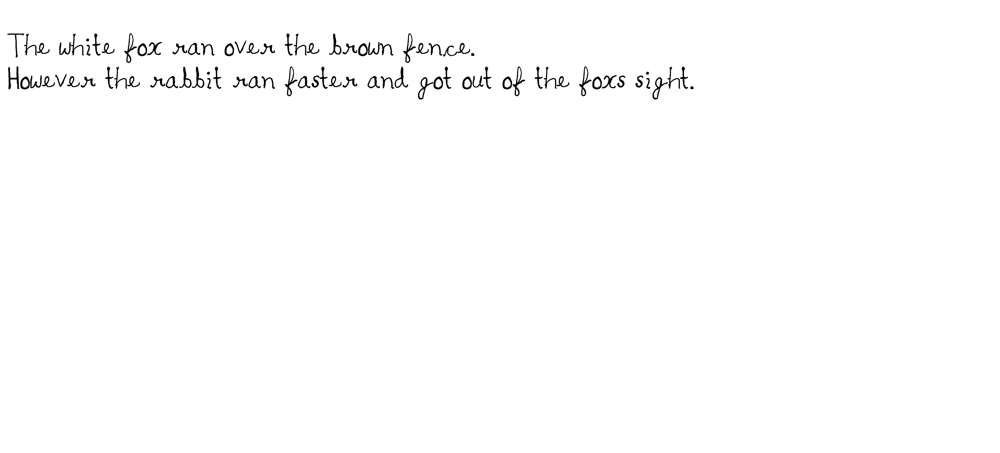

# HandwritingGen
 Generate handwriting for any text

# Handwriting Generator
 
   - Run Text2Handwriting.py file
   
     Converts input text to handwriting image
     
     Example:

        The white fox ran over the brown fence.
        However the rabbit ran faster and got out of the fox's sight.

     